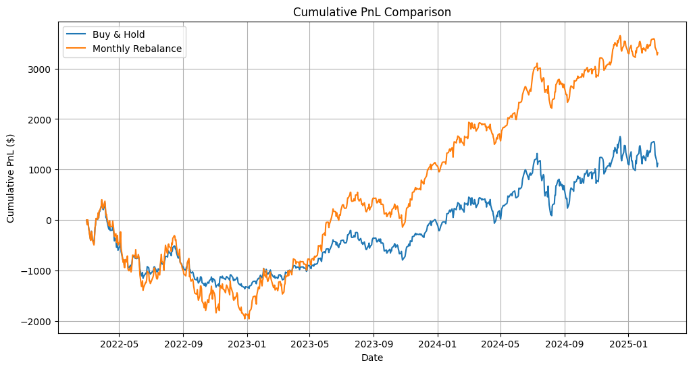
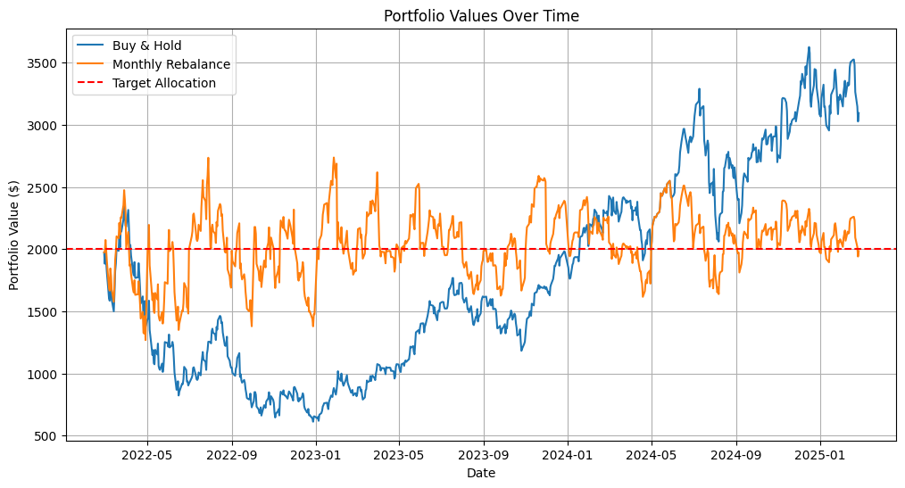

# TQQQ Monthly Rebalancing Strategy

A systematic investment strategy that maintains a fixed allocation to TQQQ (ProShares UltraPro QQQ), the triple-leveraged QQQ ETF. In `tqqq_bt.ipynb` you can find the backtest of the strategy. In `tqqq_tasty.py` you can find the production code, which works as a scheduled task.

## Strategy Overview

The strategy implements a systematic approach that:
- Maintains a fixed $2,000 allocation to TQQQ (customizable)
- Rebalances monthly on the last trading day
- Uses limit orders (0.5% from mid)
- Provides automated execution and monitoring
- Sends email notifications as soon as the script has run.

## Implementation Details

### Components
- `tqqq_tasty.py`: Live trading implementation
  - Tastyworks API integration
  - Monthly rebalancing logic
  - Limit order execution
  - Email notifications
  
- `tqqq_bt.ipynb`: Backtesting analysis
  - Historical performance evaluation
  - Strategy comparison metrics
  - Performance visualizations
  
- `settings.py`: Configuration - generated using dynaconf
  - Environment settings
  - Email settings
  - Settings file should look like this:
    ```json
    {
    "TASTY_SANDBOX_BASE_URL": "https://api.cert.tastyworks.com",
    "TASTY_PRODUCTION_BASE_URL": "https://api.tastyworks.com",
    "SESSION_SHELF_DIR": "Path/to/session_shelf",
    "ENVIRONMENT": "sandbox"  // or "production"
    }
    ```
- `.secrets.json` - gitignored - generated using dynaconf
  - Contains secrets
  - Secrets file should look like this:
    ```json
    {
    "TASTY_SANDBOX": {
      "USERNAME": "username",
      "PASSWORD": "password",
      "ACCOUNT_NUMBER": "your_account_number"
    },
    "TASTY_PRODUCTION": {
      "USERNAME": "username",
      "PASSWORD": "password",
      "ACCOUNT_NUMBER": "your_account_number"
    },
    "POLYGON": {
      "API_KEY": "api_key"
    },
    "EMAIL": {
      "SENDER": "email1",
      "SENDER_PASSWORD": "sender_password",
      "RECEIVER": "email2"
    }
    }
    ```

### Key Features
1. Position Management
   - Automatic position tracking
   - PnL calculation
   - Monthly rebalancing

2. Trade Execution
   - Limit order placement
   - 0.5% away from mid to "ensure" a fill.
   - Whole-share trading (could be extended to allow fractional shares)

3. Market Calendar Integration
   - NYSE trading calendar
   - Holiday adjustments
   - Last trading day detection

4. Monitoring
   - Email notifications
   - Trade confirmations
   - Position updates
   - Error alerts

## Backtest Results (2022-2025)
```
Strategy Metrics:
                   Buy & Hold  Monthly Rebalance
Annual Return        0.472377           0.541956
Annual Volatility    0.685682           0.950366
Sharpe Ratio         0.688915           0.570260
Max Drawdown        -1.042794          -1.001995

Trade Summary:
Total number of trades: 32

Final PnL Statistics:
Buy & Hold Final PnL: $1121.83
Rebalancing Final PnL: $3311.68

Maximum PnL:
Buy & Hold Max PnL: $1652.65
Rebalancing Max PnL: $3651.96

Minimum PnL:
Buy & Hold Min PnL: $-1362.49
Rebalancing Min PnL: $-1956.38
```

## Performance Sneak-Peeks



## Setup Instructions
1. Install dependencies
    ```bash
    poetry init
    poetry install
    ```
2. Dynaconf initialization
    ```bash
    dynaconf init -f json
    ```
3. Fill in `secrets.json` and `.secrets.json` as outlined above.
4. Change between `sandbox` and `production` in `settings.json`. The sandbox environment is for testing only, orders are never sent to an exchange. The production environment connnects to your real tasty account and your orders will go live.

